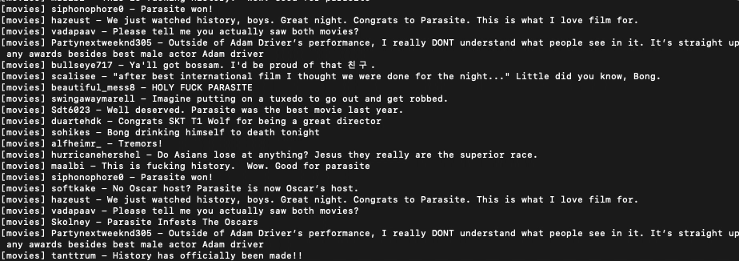

# Reddit Watcher

Allows you to watch 👀, filter 🕵, and act 🚀 on new reddit comments.

- Uses [nanoevents](https://github.com/ai/nanoevents) for emitting events.
- Supports re-auth on token expiration and backoff on rate limits.

## Usage

```
npm install reddit-watcher
```

```typescript
import { CommentWatcher, Reddit, Comment, Event } from 'reddit-watcher';

// Initialize the reddit API client.
const reddit = new Reddit({
  user: 'YOUR_REDDIT_APP_USER',
  secret: 'YOUR_REDDIT_APP_SECRET',
  userAgent: 'your_app_name (by /u/your_reddit_username)',
});

// Create a new watcher.
const watcher = new CommentWatcher({
  reddit,

  // Optional subreddit, default is "all"
  subreddit: 'movies',

  // Optional filter for comments
  filter: (comment: Comment) => comment.nsfw === false,

  // Optional, default is false.
  // Uses pagination to only request new comments
  //
  // Without it you can get many duplicate comments between calls
  // in less active subreddits.
  //
  // In more active subreddits it's recommended to disable it,
  // otherwise the watcher will lag behind quickly.
  usePagination: true,

  // Optional, default is 0.
  // Limits how frequently Reddit's API will be called.
  //
  // On less active subreddits, with a minTimeBetweenRequests of 0
  // you'll be performing too many requests and getting few new comments
  // in return.
  minTimeBetweenRequests: 1000 * 60,
});

watcher.on(Event.COMMENTS, (comments: Comment[]) => {
  for (const comment of comments) {
    console.log(`[${comment.subreddit}] ${comment.author} - ${comment.body}`);
  }
});

// Watch him as he goes.
watcher.start();
```


